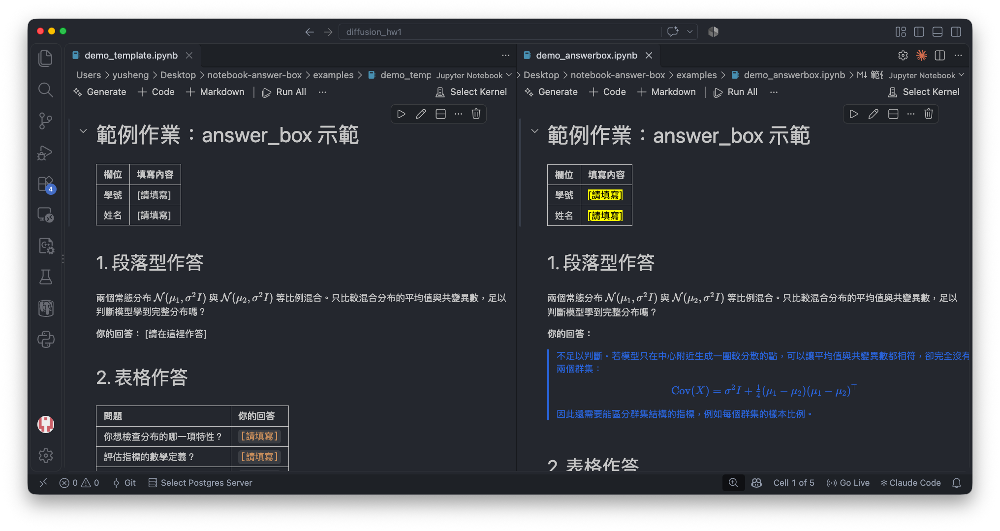

# notebook-answer-box

讓作業 notebook 的作答處一眼可見：**未答的地方是黃底，答案是藍字**，像用藍筆寫考卷。

[](https://colab.research.google.com/github/yusheng-ma/notebook-answer-box/blob/main/examples/demo_answerbox.ipynb)

> GitHub 的 notebook 預覽會拿掉 inline style，看不到藍字；請用上面的 Colab 連結，或下載後用 VS Code／Jupyter 開 [`examples/demo_answerbox.ipynb`](examples/demo_answerbox.ipynb)。



只用 Python 標準函式庫，不需要安裝任何套件。

## 用法

```bash
python3 answer_box.py apply HW.ipynb         # 把所有作答處包成答案框（直接修改檔案，請先備份）
python3 answer_box.py check HW.ipynb         # 列出還沒答的地方、欄位數不對的表格
python3 answer_box.py strip HW.ipynb [OUT]   # 移除所有樣式，輸出 HW_plain.ipynb（原檔不動）
```

`apply` 可以重複執行，已經套過的地方不會再包一次。

## 會被轉換的作答處

| template 裡的寫法 | 轉換後 |
| --- | --- |
| 整行只有 `[請在這裡作答]` 或 `` `[請…]` `` | 藍色左框段落 |
| `**你的回答：** [請填寫]` | 標題保留，下面接藍色左框段落 |
| 表格格子 `[請填寫]`、`[填寫]` | 藍字格子；同一列的空白格也一起補上 |
| 表格選項 `符合／部分符合／不符合` | 黃底，作答時換成選定的一項 |
| 引用區塊裡的填空 `__________` | 藍字填空 |

只處理 markdown cell，code cell 不動。

## 怎麼作答

把整個 `<mark>…</mark>` 換成答案，外層的 `<div>`／`<span>` 不要動：

```html
<div style="color:#2f6fe0; border-left:3px solid #2f6fe0; padding-left:10px">

這裡寫答案，可以有好幾段、$\LaTeX$ 和 。

</div>
```

- `<div …>` 下一行和 `</div>` 上一行的**空行要保留**，否則框內的 markdown 與數學式不會 render。
- 表格格子裡換行用 `<br>`；絕對值寫 `\lvert x\rvert`，不要用 `|`（會被當成欄位分隔，`check` 會抓出來）。
- 文字顏色跑到框外：多半是不小心刪掉了 `</span>` 或 `</div>`。

## 給出作業的人

在 template 上跑一次 `apply` 再發給學生，學生打開就知道哪裡要作答，批改時答案和題目也分得開。若想發乾淨版本，`strip` 可以還原。
